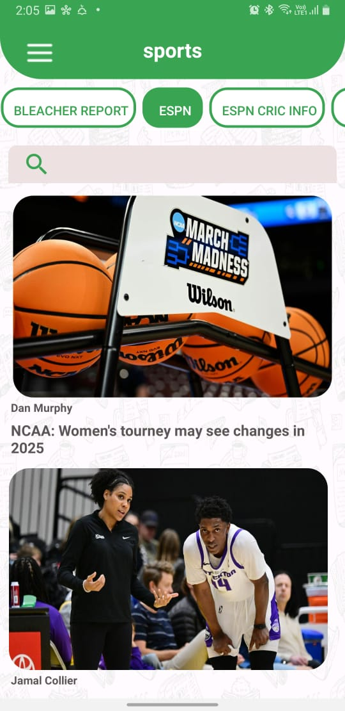
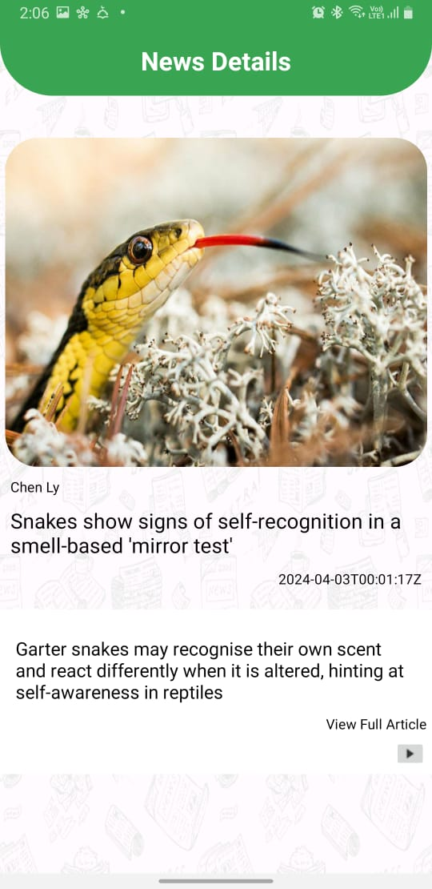
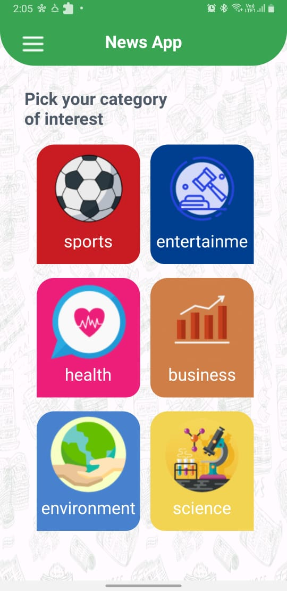

## News Application
This NewsApp project is developed with MVVM architecture. It provides live top news. Allow you to browse by specific category such as by sprots, by science, by entertainment. You can also search with keywords.

* **Features:**
     * Browse top headlines from news sources.
     * Search for specific news articles with keyword. 
     * Browse news articles by specific categories .
     * Article detailed screen displaying full article content.
       
* **Technologies:**
     * Kotlin as it provides modern features, concise syntax, null safety.
     * MVVM Architecture is Design pattern to separate program logic and user interface controls.
     * Coroutines for concurrent tasks.
     * Retrofit and OkHttp for making network requests to RESTful APIs.
     * Romm DB for caching data.
       
* **Screen Shots From App:**
<table>
  <tr>
    <td></td>
    <td></td>
  </tr>
</table>
<table>
  <tr>
    <td></td>
    <td></td>
  </tr>
</table>
<table>
  <tr>
    <td></td>
  </tr>
</table>
